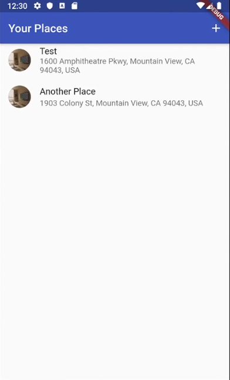
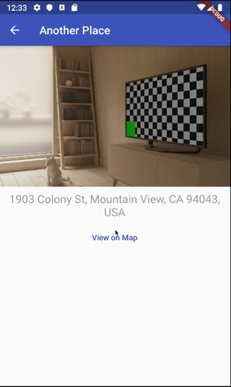
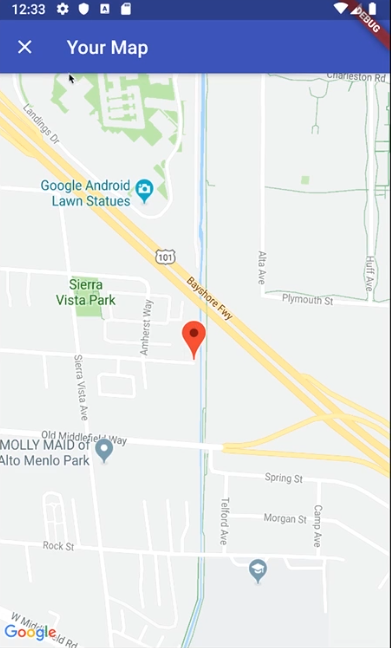
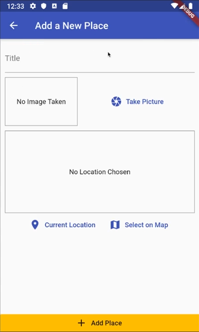
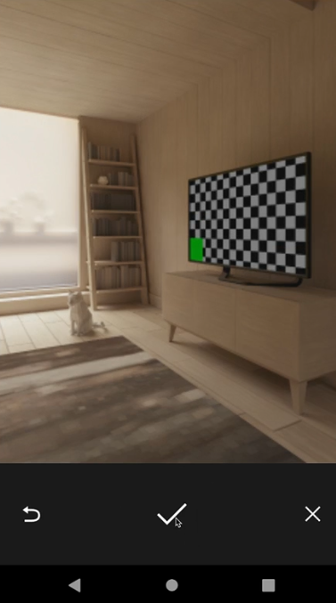
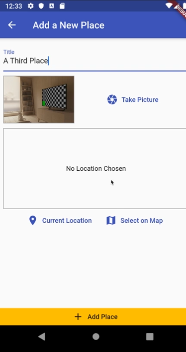
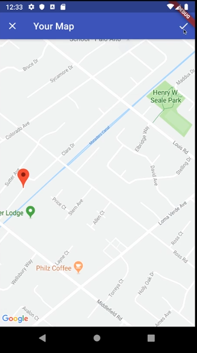
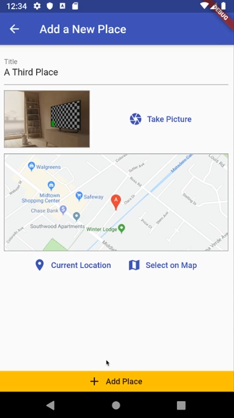
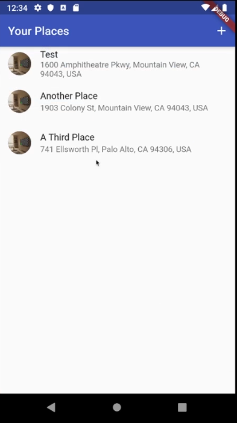

# Project Title

Great Places Tracker with Flutter 

Introducing "Great Places Tracker," a powerful Flutter application that seamlessly integrates with native device features to provide users with a memorable experience of storing and managing their favorite places. This app harnesses the functionalities of the camera, maps, location services, and SQLite database to create a comprehensive solution for capturing and storing images and locations of great places visited by users.

The app comprises three main screens, each designed to facilitate a specific task. Upon launching the app, users are greeted with the first screen, which displays a list of the great places they have visited. Each entry in the list provides a quick glance at the place's title and a preview of the associated image. By selecting a place from the list, users can navigate to the second screen, where they can explore detailed information about the place.

The second screen showcases a captivating interface that features the place's picture, title, and address. In addition, users can view a preview of the location on a map. To further enhance their experience, a "Show on Map" button is provided, allowing users to open the map with the location of the place conveniently marked.

The app's first screen incorporates an intuitive user interface, with an app bar housing an "Add" icon button. By tapping on this button, users are directed to a new screen dedicated to adding a new place to their collection. Here, users are prompted to fill in essential information about the place, such as the title, image, and location.

To facilitate capturing images, the "Add Place" screen integrates with the device's camera functionality. A "Take Image" button initiates the mobile camera app, enabling users to capture a picture of the place instantly. This seamless integration simplifies the process of associating captivating images with the visited locations.

For location information, users are presented with two options. The first option is to automatically retrieve the user's current location using the device's location services. This feature enables users to effortlessly store the precise location of the place they are currently visiting.

The second option allows users to manually select a location on a map. By clicking the "Select on Map" button, users can access a map interface, which empowers them to pinpoint the exact location of the place they wish to add. This flexibility ensures that users can accurately save their favorite places, regardless of their current location.

To ensure seamless data management, the app utilizes SQLite as the underlying database system. This lightweight and efficient database technology enable users to store and retrieve their great places effortlessly. The app leverages the power of SQL queries to provide fast and reliable access to the stored data, allowing users to manage their collection efficiently.

With its intuitive user interface, integration with native device features, and robust database capabilities, the "Great Places Tracker" Flutter app is the perfect companion for adventure seekers, travel enthusiasts, and anyone passionate about documenting and preserving their cherished memories of the places they have visited.

# 📸 Screenshots
The screenshots below are taken on an Android emulator.

| 1 | 2|
|------|-------|
|||

| 3 | 4|
|------|-------|
|||

| 5 | 6|
|------|-------|
|||

| 7 | 8|
|------|-------|
|||

| 9 | 10|
|------|-------|
|||
